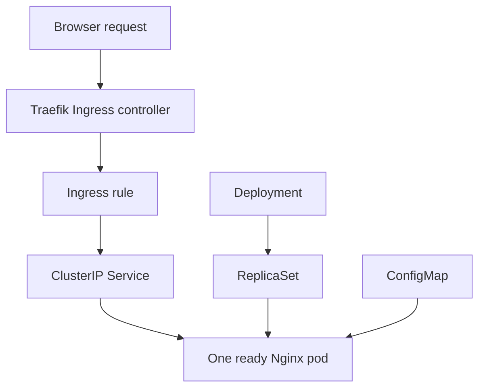

# Understanding TimesheetTracking

This guide explains every technical part of the TimesheetTracking Kubernetes exercise. It assumes that the reader is new to containers and Kubernetes. The explanations are direct and technical; no previous Kubernetes knowledge is required.

The application exposes two URLs:

| URL path | Response |
| --- | --- |
| `/web` | `TimesheetTracking web service is running` |
| `/status` | `TimesheetTracking service is healthy` |

Both paths use the hostname `timesheettracking.local`, so the full URLs are:

```text
http://timesheettracking.local/web
http://timesheettracking.local/status
```

This is a small training application. It does not contain timesheet business logic, a database, or a designed web interface. Its purpose is to show how Kubernetes runs an application and makes two paths reachable.

---

## 1. What is running

The application uses the official `nginx:alpine` container image. Nginx is a web server. It listens for HTTP requests on port 80 and returns files as HTTP responses.

The ConfigMap provides these files inside each Nginx container:

```text
/usr/share/nginx/html/web
/usr/share/nginx/html/status
/etc/nginx/conf.d/default.conf
```

The first two files contain the response text. The third file tells Nginx how to serve those files.

Two identical pods are requested. A Service provides one stable internal destination for both pods. An Ingress sends external requests for the configured hostname and paths to that Service.

---

## 2. Technical order of the components

The main runtime hierarchy is:

```text
Container image → Container → Pod → ReplicaSet → Deployment
```

The networking path is:

```text
Browser → Windows hosts file → Traefik → Ingress rule → Service → Pod → Nginx
```

The complete relationship is:



Each term has a separate meaning:

### Container image

A container image is a packaged filesystem and startup configuration. It contains the software needed to start a container. In this exercise, the image is:

```text
nginx:alpine
```

- `nginx` is the image repository name.
- `alpine` is the image tag.
- The tag selects the Alpine Linux-based Nginx image variant.

An image is not a running application. It is the package used to create a running container.

### Container

A container is a running instance of an image. The Nginx process runs inside the container. Kubernetes starts and stops the container as part of a pod.

### Pod

A pod is the smallest deployable runtime object in Kubernetes. A pod contains one or more containers that share the pod's network identity and storage definitions.

This exercise uses one Nginx container per pod. Each pod receives its own internal pod IP address. Pod names and pod IP addresses can change whenever Kubernetes replaces a pod.

### ReplicaSet

A ReplicaSet keeps a specified number of matching pods present. The Deployment automatically creates and manages the ReplicaSet. You do not create the ReplicaSet YAML in this exercise.

### Deployment

A Deployment defines the required pod template and the required number of replicas. It creates ReplicaSets and performs rolling updates when the pod template changes.

This exercise requests two replicas:

```yaml
replicas: 2
```

This means Kubernetes tries to keep two TimesheetTracking pods running. Because Rancher Desktop normally uses one local node, two replicas protect against a single container or pod failure, but they do not protect against the entire local node stopping.

---

## 3. The five Kubernetes resources

The exercise directly creates these resources:

| Resource | Name | Namespace | Main responsibility |
| --- | --- | --- | --- |
| Namespace | `timesheet-ns` | Not applicable | Contains the other resources. |
| ConfigMap | `timesheettracking-content` | `timesheet-ns` | Stores response content and Nginx configuration. |
| Deployment | `timesheettracking` | `timesheet-ns` | Maintains two Nginx pods. |
| Service | `timesheettracking-svc` | `timesheet-ns` | Provides stable internal access to the pods. |
| Ingress | `timesheettracking-ingress` | `timesheet-ns` | Defines hostname and path routing. |

Kubernetes also creates some resources automatically:

- The Deployment creates a ReplicaSet.
- The ReplicaSet creates pods.
- The Service controller creates EndpointSlices containing the selected pod addresses.

---

## 4. Namespace

The Namespace file is `01-namespace.yaml`:

```yaml
apiVersion: v1
kind: Namespace
metadata:
  name: timesheet-ns
```

### Field explanation

- `apiVersion: v1` selects the Kubernetes API version used for a Namespace.
- `kind: Namespace` tells Kubernetes which resource type to create.
- `metadata` contains identifying information about the resource.
- `metadata.name: timesheet-ns` assigns the resource name.

All other files contain:

```yaml
namespace: timesheet-ns
```

That places them inside this namespace.

A namespace separates resource names and makes the exercise easier to query and delete. For example, the following command displays only pods in this namespace:

```powershell
kubectl get pods -n timesheet-ns
```

The short option `-n` means `--namespace`.

A namespace is not automatically a complete security boundary. Access control and network isolation require additional Kubernetes configuration, which is outside this exercise.

---

## 5. ConfigMap

The ConfigMap file is `02-configmap.yaml`:

```yaml
apiVersion: v1
kind: ConfigMap
metadata:
  name: timesheettracking-content
  namespace: timesheet-ns
data:
  web: |
    TimesheetTracking web service is running
  status: |
    TimesheetTracking service is healthy
  default.conf: |
    server {
        listen 80;
        server_name _;
        default_type text/plain;

        location / {
            root /usr/share/nginx/html;
        }
    }
```

### What a ConfigMap stores

A ConfigMap stores non-secret configuration data as key-value pairs. It is appropriate for application settings and small text files. It must not be used for passwords, tokens, certificates, or other secrets. Kubernetes provides the Secret resource type for sensitive values.

The `data` section contains three keys:

| ConfigMap key | Value | Use inside the container |
| --- | --- | --- |
| `web` | Web endpoint response text | Mounted as `/usr/share/nginx/html/web` |
| `status` | Health response text | Mounted as `/usr/share/nginx/html/status` |
| `default.conf` | Nginx server configuration | Mounted as `/etc/nginx/conf.d/default.conf` |

### Meaning of `|`

The YAML `|` character starts a block scalar. The indented lines below it are treated as one multi-line string. It is used here because Nginx configuration and response content are text.

### Nginx configuration

The Nginx fields mean:

- `server { ... }` defines one HTTP virtual server.
- `listen 80;` makes Nginx listen on TCP port 80 inside the container.
- `server_name _;` provides a catch-all server name for this simple configuration.
- `default_type text/plain;` sets the HTTP content type when a filename has no recognized extension.
- `location / { ... }` handles request paths starting with `/`.
- `root /usr/share/nginx/html;` maps the request path to a file in that directory.

For `/web`, Nginx creates this filesystem path:

```text
/usr/share/nginx/html + /web
= /usr/share/nginx/html/web
```

For `/status`, Nginx creates:

```text
/usr/share/nginx/html + /status
= /usr/share/nginx/html/status
```

---

## 6. Deployment

The Deployment file is `03-deployment.yaml`:

```yaml
apiVersion: apps/v1
kind: Deployment
metadata:
  name: timesheettracking
  namespace: timesheet-ns
spec:
  replicas: 2
  selector:
    matchLabels:
      app: timesheettracking
  template:
    metadata:
      labels:
        app: timesheettracking
    spec:
      containers:
        - name: nginx
          image: nginx:alpine
          ports:
            - containerPort: 80
          volumeMounts:
            - name: content
              mountPath: /usr/share/nginx/html
            - name: nginx-config
              mountPath: /etc/nginx/conf.d/default.conf
              subPath: default.conf
      volumes:
        - name: content
          configMap:
            name: timesheettracking-content
            items:
              - key: web
                path: web
              - key: status
                path: status
        - name: nginx-config
          configMap:
            name: timesheettracking-content
            items:
              - key: default.conf
                path: default.conf
```

### Main Deployment fields

- `apiVersion: apps/v1` selects the API used for Deployments.
- `kind: Deployment` creates a Deployment resource.
- `metadata.name` is the Deployment name used in commands.
- `metadata.namespace` places it in `timesheet-ns`.
- `spec.replicas: 2` requests two pod copies.

### Selector and pod label

The Deployment selector is:

```yaml
selector:
  matchLabels:
    app: timesheettracking
```

The pod template applies this label:

```yaml
template:
  metadata:
    labels:
      app: timesheettracking
```

These values must match. The selector tells the Deployment which pods it owns. A Deployment selector cannot be changed after the Deployment is created.

### Pod template

Everything under `spec.template` describes the pods that the Deployment creates. Changing the pod template creates a new Deployment revision and normally starts a rolling update.

### Container configuration

```yaml
containers:
  - name: nginx
    image: nginx:alpine
```

- `containers` is a list because a pod can contain multiple containers.
- `name: nginx` gives this container a name inside the pod.
- `image: nginx:alpine` identifies the image used to create the container.

### Container port

```yaml
ports:
  - containerPort: 80
```

This documents that the container listens on port 80. The field does not, by itself, expose the container outside the pod. The Service and Ingress provide access.

### Volumes and volume mounts

A `volume` makes data available to a pod. A `volumeMount` places that volume at a specific path inside a container.

The names connect the two sections:

| Volume name | Volume source | Container mount |
| --- | --- | --- |
| `content` | ConfigMap keys `web` and `status` | `/usr/share/nginx/html` |
| `nginx-config` | ConfigMap key `default.conf` | `/etc/nginx/conf.d/default.conf` |

The first mount is a directory mount:

```yaml
- name: content
  mountPath: /usr/share/nginx/html
```

It places both selected ConfigMap items in the Nginx content directory.

The second mount is a single-file mount:

```yaml
- name: nginx-config
  mountPath: /etc/nginx/conf.d/default.conf
  subPath: default.conf
```

`subPath` selects one file from the volume. Without `subPath`, mounting the volume at `/etc/nginx/conf.d/default.conf` would not correctly mount it as one file.

ConfigMap volumes are read-only from the container's point of view. Nginx only needs to read these files.

### Exact ConfigMap key matching

The following names must match exactly:

```yaml
# ConfigMap data key
default.conf: |

# Deployment volume item
key: default.conf
path: default.conf

# Container mount
subPath: default.conf
```

`default.conf` and `default_type.conf` are different names. Kubernetes does not guess that they refer to the same file.

If the Deployment requests a ConfigMap key that does not exist, Kubernetes cannot prepare the pod volume. The container does not start. `kubectl describe pod` shows the volume error in the Events section.

### ConfigMap changes and `subPath`

A file mounted using `subPath` does not receive automatic ConfigMap updates inside an existing container. After changing `default.conf`, restart the Deployment:

```powershell
kubectl apply -f 02-configmap.yaml
kubectl rollout restart deployment/timesheettracking -n timesheet-ns
```

The restarted pods receive the new file.

---

## 7. Service

The Service file is `04-service.yaml`:

```yaml
apiVersion: v1
kind: Service
metadata:
  name: timesheettracking-svc
  namespace: timesheet-ns
spec:
  type: ClusterIP
  selector:
    app: timesheettracking
  ports:
    - port: 80
      targetPort: 80
```

### Why a Service is required

Pods are replaceable. A replacement pod can have a different name and pod IP address. The Ingress must not depend on one changing pod address.

The Service provides:

- A stable resource name: `timesheettracking-svc`.
- A stable internal ClusterIP address.
- Selection of the current matching pods.
- Distribution of requests across the available matching pods.

### Service type

`type: ClusterIP` makes the Service reachable inside the Kubernetes cluster. It is not directly published as an external Windows port. The Ingress controller accesses the ClusterIP Service from inside the cluster.

### Service selector

```yaml
selector:
  app: timesheettracking
```

The Service searches for pods with the exact label `app: timesheettracking`. This value must match the pod-template label in the Deployment.

If the values do not match, the Service still exists, but it has no pod endpoints and cannot return the application response.

### `port` and `targetPort`

```yaml
ports:
  - port: 80
    targetPort: 80
```

- `port` is the port exposed by the Service.
- `targetPort` is the port to which the Service forwards inside the selected pods.

Both are 80 in this exercise. They do not have to be the same in every application.

### EndpointSlice

Kubernetes represents the pod addresses behind a Service using EndpointSlice resources. Check them with:

```powershell
kubectl get endpointslice -n timesheet-ns -l kubernetes.io/service-name=timesheettracking-svc
```

The older `Endpoints` API is deprecated in recent Kubernetes versions. The command `kubectl get endpoints` can still work but may display a warning.

---

## 8. Ingress and Traefik

The Ingress file is `05-ingress.yaml`:

```yaml
apiVersion: networking.k8s.io/v1
kind: Ingress
metadata:
  name: timesheettracking-ingress
  namespace: timesheet-ns
spec:
  ingressClassName: traefik
  rules:
    - host: timesheettracking.local
      http:
        paths:
          - path: /web
            pathType: Prefix
            backend:
              service:
                name: timesheettracking-svc
                port:
                  number: 80
          - path: /status
            pathType: Prefix
            backend:
              service:
                name: timesheettracking-svc
                port:
                  number: 80
```

### Ingress resource versus Ingress controller

These are different components:

- The **Ingress resource** is the routing configuration created by `05-ingress.yaml`.
- The **Ingress controller** is the running software that reads the configuration and handles network traffic.

Traefik is the Ingress controller in this exercise. Rancher Desktop normally installs it. Creating an Ingress resource does not install Traefik.

### Ingress class

```yaml
ingressClassName: traefik
```

This tells Kubernetes and Traefik that the rule belongs to the Traefik controller.

### Host rule

```yaml
host: timesheettracking.local
```

The rule applies only when the HTTP `Host` header is `timesheettracking.local`. A request sent with a different hostname does not match this rule.

### Path rules

The Ingress contains separate rules for `/web` and `/status`. Both send traffic to:

```text
Service: timesheettracking-svc
Port:    80
```

`pathType: Prefix` performs path-element prefix matching. `/web` and `/web/example` can match the `/web` rule. This Ingress does not define a rewrite, so Traefik forwards the original path to Nginx.

The only existing files are `/web` and `/status`. A longer path such as `/web/example` reaches Nginx but does not have a matching file, so Nginx returns a not-found response.

---

## 9. Windows hosts file

`timesheettracking.local` is not a public DNS record. The Windows hosts file provides a local name-to-address mapping:

```text
127.0.0.1 timesheettracking.local
```

The hosts file performs only hostname resolution. It does not understand Kubernetes namespaces, Services, ports, or paths.

When the browser opens `http://timesheettracking.local/web`:

1. Windows resolves `timesheettracking.local` to `127.0.0.1`.
2. The browser connects using HTTP port 80 because the URL starts with `http://` and does not specify another port.
3. Rancher Desktop makes the Traefik entry point available locally.
4. Traefik examines the hostname and path.
5. The Ingress rule identifies `timesheettracking-svc` port 80.
6. The Service selects a ready pod.
7. Nginx receives `/web` and returns the `web` file.

The hosts file must be edited with Administrator permission because it is a protected Windows system file.

---

## 10. Complete request flow

For this request:

```text
GET http://timesheettracking.local/web
```

the flow is:

1. The browser resolves `timesheettracking.local` using the Windows hosts file.
2. The browser sends an HTTP request containing host `timesheettracking.local` and path `/web`.
3. Traefik accepts the request on port 80.
4. The Ingress host rule matches `timesheettracking.local`.
5. The Ingress path rule matches `/web`.
6. The Ingress backend identifies Service `timesheettracking-svc`, port 80.
7. The Service selector finds pods labeled `app: timesheettracking`.
8. The Service forwards the request to port 80 of one ready pod.
9. Nginx maps `/web` to `/usr/share/nginx/html/web`.
10. Nginx returns the file with HTTP content type `text/plain`.
11. The browser displays `TimesheetTracking web service is running`.

The `/status` flow is identical except that Nginx reads `/usr/share/nginx/html/status`.

---

## 11. Why Chrome downloaded `/web`

An HTTP response contains headers and a body. The `Content-Type` header tells the client how to handle the body.

Correct header for this exercise:

```text
Content-Type: text/plain
```

With `text/plain`, Chrome displays the response as text.

The Nginx default can be:

```text
Content-Type: application/octet-stream
```

`application/octet-stream` means general binary data. Browsers normally download that response instead of displaying it.

The `web` and `status` files have no extensions. Without the custom `default.conf`, Nginx cannot identify their MIME type from a filename extension. The line below supplies the required default:

```nginx
default_type text/plain;
```

In the failed configuration, the ConfigMap contained a key named `default.conf`, but the Deployment requested `default_type.conf`. Because the requested key did not exist:

1. The new pods could not mount the Nginx configuration.
2. The new containers did not start.
3. The rolling update remained incomplete.
4. Kubernetes kept an older pod available.
5. The older pod could return the extensionless file using the default binary content type.
6. Chrome downloaded the file.

Correcting the key name allows the new pods to start with the custom Nginx configuration.

Chrome can cache an earlier response. After fixing the server, `/web?v=2` uses a different URL and avoids the earlier cache entry.

---

## 12. Labels, selectors, names, and ports that must match

Kubernetes connects resources through exact names and labels. It does not automatically correct spelling differences.

| Defined value | Referenced by | Required match |
| --- | --- | --- |
| Namespace `timesheet-ns` | ConfigMap, Deployment, Service, Ingress and commands | All resources must use the intended namespace. |
| ConfigMap `timesheettracking-content` | Both Deployment volume definitions | `configMap.name` must match the ConfigMap name. |
| ConfigMap key `default.conf` | Nginx-config volume and `subPath` | The key, volume path, and subPath must match. |
| Volume `content` | Content `volumeMount` | `volumeMounts[].name` must match `volumes[].name`. |
| Volume `nginx-config` | Nginx-config `volumeMount` | `volumeMounts[].name` must match `volumes[].name`. |
| Pod label `app: timesheettracking` | Deployment selector and Service selector | All values must match exactly. |
| Service `timesheettracking-svc` | Both Ingress backends | The backend Service name must exist in the same namespace. |
| Service port `80` | Both Ingress backends | The Ingress backend port must match a Service port. |
| Service `targetPort: 80` | Nginx container listener | Nginx must listen on the target port. |
| Host `timesheettracking.local` | Windows hosts file and browser URL | The hostname sent by the browser must match the Ingress host. |

---

## 13. What `kubectl apply` does

`kubectl apply -f <file>` sends the YAML definition to the Kubernetes API server.

- If the resource does not exist, Kubernetes creates it.
- If it exists and the definition changed, Kubernetes updates it.
- If it already matches, Kubernetes reports it as unchanged.

Kubernetes then continuously tries to make the actual state match the requested state. This is called reconciliation.

For example, if the Deployment requires two replicas and one pod stops, the Deployment and ReplicaSet controllers create a replacement pod.

An `apply` result of `created` or `configured` means the API accepted the resource. It does not guarantee that a pod started successfully. Always check the rollout and pod status.

---

## 14. Rolling updates and ReplicaSets

When the Deployment pod template changes, Kubernetes normally performs a rolling update:

1. The Deployment creates a new ReplicaSet for the new pod template.
2. The new ReplicaSet starts new pods.
3. Kubernetes waits for new pods to become available.
4. Kubernetes reduces the old ReplicaSet.
5. The update finishes after the required new pods are available.

If new pods cannot start, Kubernetes can retain an old pod to preserve some availability. This explains an output such as:

```text
Deployment: 1/2 ready
Old ReplicaSet: 1 ready pod
New ReplicaSet: 2 failing pods
```

This does not mean Kubernetes requires three permanent pods. It means the desired replica count is two, but the rolling update is temporarily using old and new ReplicaSets. The update cannot finish until the new pods work.

Useful commands:

```powershell
kubectl rollout status deployment/timesheettracking -n timesheet-ns
kubectl rollout history deployment/timesheettracking -n timesheet-ns
kubectl get replicasets -n timesheet-ns
kubectl describe deployment timesheettracking -n timesheet-ns
```

---

## 15. Understanding common status output

### Pod columns

Example:

```text
READY   STATUS    RESTARTS   AGE
1/1     Running   0          2m
```

- `READY 1/1` means the one container in the pod is ready.
- `STATUS Running` means the pod is running.
- `RESTARTS 0` means Kubernetes has not restarted the container.
- `AGE` shows how long the pod object has existed.

Common problem statuses:

| Status | Meaning |
| --- | --- |
| `Pending` | Kubernetes has accepted the pod but it is not running yet. |
| `ContainerCreating` | Kubernetes is preparing the container, image, network, or volumes. |
| `CreateContainerConfigError` | Kubernetes cannot build the container configuration, often because a ConfigMap key or Secret is missing. |
| `ImagePullBackOff` | Kubernetes cannot download the requested container image. |
| `CrashLoopBackOff` | The container repeatedly starts and exits. |
| `Error` | The container or pod ended with an error. Inspect `describe` and logs. |
| `Terminating` | Kubernetes is stopping and removing the pod. |

### Deployment columns

Example:

```text
READY   UP-TO-DATE   AVAILABLE
2/2     2            2
```

- `READY 2/2` means two of the two desired replicas are ready.
- `UP-TO-DATE 2` means two pods use the latest pod template.
- `AVAILABLE 2` means two pods are available to serve traffic.

If the values show `1/2`, `2`, and `1`, Kubernetes created pods for the latest template but only one pod is available. The pod list, pod Events, and logs identify the reason.

### Service endpoints

An EndpointSlice containing pod addresses means the Service found matching pods. An empty EndpointSlice normally indicates a label-selector mismatch or unavailable pods.

### Ingress address

The Ingress `ADDRESS` is the address reported by the Ingress controller. A populated address does not prove that the backend pods work. It only shows that the controller recognized the Ingress.

---

## 16. How to diagnose by layer

Check the system from the pod outward:

| Layer | Command | What it proves |
| --- | --- | --- |
| Deployment | `kubectl rollout status deployment/timesheettracking -n timesheet-ns` | Whether the current revision completed. |
| Pods | `kubectl get pods -n timesheet-ns` | Whether containers are running and ready. |
| Pod setup | `kubectl describe pod <pod-name> -n timesheet-ns` | Scheduling, image, volume, and startup Events. |
| Application logs | `kubectl logs <pod-name> -n timesheet-ns` | What the current Nginx container reported. |
| Previous container | `kubectl logs <pod-name> -n timesheet-ns --previous` | Logs from the previous container instance after a restart. |
| Service selection | `kubectl get endpointslice -n timesheet-ns -l kubernetes.io/service-name=timesheettracking-svc` | Whether the Service found pod addresses. |
| Service response | `kubectl port-forward service/timesheettracking-svc 8080:80 -n timesheet-ns` | Allows a direct local Service test without Ingress. |
| Ingress rule | `kubectl describe ingress timesheettracking-ingress -n timesheet-ns` | Host, paths, backend Service, and controller Events. |
| HTTP response | `curl.exe -i http://timesheettracking.local/web` | Status, headers, and response body from the complete path. |

This order avoids changing the Ingress when the real problem is a failed pod, or changing the pod when the real problem is the Windows hostname.

---

## 17. YAML basics used in these files

YAML represents structured data using indentation.

### Key and value

```yaml
kind: Service
```

`kind` is the key and `Service` is the value.

### Nested object

```yaml
metadata:
  name: timesheettracking-svc
  namespace: timesheet-ns
```

The indented `name` and `namespace` fields belong to `metadata`.

### List item

```yaml
ports:
  - port: 80
    targetPort: 80
```

The hyphen starts an item in a list. `ports` is a list because a Service can expose more than one port.

### Multi-line text

```yaml
web: |
  TimesheetTracking web service is running
```

The `|` keeps the following indented text as a multi-line string.

### Indentation rules

- Use spaces, not tab characters.
- Keep fields that belong to the same level aligned.
- Child fields must be indented farther than their parent.
- File names and Kubernetes object names are case-sensitive in the places where Kubernetes treats them as identifiers.

Before applying a file, Kubernetes can check its structure without saving the resource:

```powershell
kubectl apply --dry-run=client -f 03-deployment.yaml
```

This catches YAML parsing and some client-side validation errors. It cannot prove that referenced resources or ConfigMap keys exist in the cluster.

---

## 18. Glossary

| Term | Technical meaning in this exercise |
| --- | --- |
| API server | The Kubernetes component that accepts `kubectl` requests and stores resource definitions. |
| Cluster | The Kubernetes environment managed locally by Rancher Desktop. |
| Node | A machine that runs pods. Rancher Desktop normally provides one local Kubernetes node. |
| Container image | The packaged software and filesystem used to start a container. |
| Container | A running instance of an image. |
| Pod | The Kubernetes runtime object containing the Nginx container. |
| Replica | One pod copy created from the Deployment template. |
| ReplicaSet | The Deployment-managed object that maintains a pod count. |
| Deployment | The controller that manages the pod template, ReplicaSets, replicas, and rolling updates. |
| ConfigMap | A Kubernetes object containing non-secret configuration values. |
| Volume | Data made available to containers in a pod. |
| Volume mount | The path where a container receives a volume. |
| `subPath` | A way to mount one selected file or directory from a volume. |
| Label | A key-value tag attached to a Kubernetes object. |
| Selector | A query that finds objects with matching labels. |
| Service | A stable internal network destination for selected pods. |
| ClusterIP | The internal virtual IP assigned to a Service. |
| EndpointSlice | A Kubernetes object listing backend pod addresses for a Service. |
| Ingress | A Kubernetes resource containing HTTP host and path routing rules. |
| Ingress controller | Software, Traefik here, that implements Ingress rules. |
| Hostname | The host part of a URL, `timesheettracking.local` here. |
| Path | The part after the hostname, such as `/web` or `/status`. |
| Port | A numbered network endpoint; HTTP uses port 80 here. |
| HTTP status | A numeric response result; `200` means the request succeeded. |
| Content type | The HTTP header describing response data, such as `text/plain`. |
| MIME type | Another name for a media or content type used in HTTP. |
| Rolling update | Gradual replacement of old Deployment pods with new ones. |
| Reconciliation | Kubernetes repeatedly making actual state match requested state. |
| `kubectl` | The command-line client used to communicate with Kubernetes. |

For the complete setup, commands, expected outputs, update procedure, and troubleshooting steps, see `RUN-GUIDE.md`.
