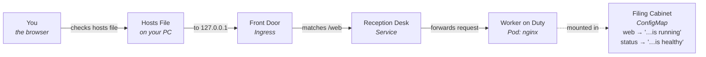

# Understanding TimesheetTracking

*Field Guide · Part 2 of 2*

What each of the five files actually does, why it exists, and the five Kubernetes ideas behind all of it — explained without assuming you already know any of them.

Think of the whole exercise as a small office. Somewhere in a shared building, your team gets **one labeled drawer** to keep its things separate from every other team's. Inside that drawer sits a **filing cabinet** of documents already typed up and ready to hand out, a **worker** whose one job is described on a clipboard, a **reception desk** with a single phone number that always reaches whichever worker is currently on duty, and a **front door** that reads the address on incoming mail and walks it to the right desk. That's a namespace, a ConfigMap, a Deployment, a Service, and an Ingress — in that order, that's this entire exercise.

---

## The big picture: where one request actually goes

Follow a single visit to `timesheettracking.local/web` from your browser all the way to the text that comes back.



A request for `/web` travels Browser → hosts file → Ingress (reads the path) → Service → Pod. The Pod's reply is one of two plain-text files the ConfigMap placed inside it.

---

## Five ideas, in plain words

No jargon — just what each thing is for, and why this exercise needed it.

### Namespace — a labeled drawer

> "Not the whole filing room — just our drawer."

A namespace is a named area inside the cluster. Everything you create can be dropped into one, and things in different namespaces can reuse the same names without colliding — another exercise's Service called `timesheettracking-svc` in a different drawer is a completely different object.

**Here:** every other resource in this exercise lists `namespace: timesheet-ns`, so it's easy to find everything — and delete everything — as one group.

### ConfigMap — pre-typed index cards

> "Don't write it yourself — here's the card, already filled in."

A ConfigMap holds small pieces of text — settings, or in this case, whole files — that you hand to a container instead of baking them into the image. Change the ConfigMap and you're changing what the app serves, without rebuilding anything.

**Here:** it holds two entries, `web` and `status`, which become two real files once mounted — that's the entire content of the website.

### Deployment — the clipboard of instructions

> "One worker, this exact job, and if they ever leave — replace them immediately."

A Deployment describes the job: which container image to run, how many copies (replicas) should be running at once, and what to do if one disappears. Kubernetes then keeps making that true, continuously, without you watching it.

**Here:** the instructions say exactly one replica of `nginx:alpine`, listening on port 80, with the ConfigMap's files attached at `/usr/share/nginx/html` — the folder nginx serves by default.

### Service — the one phone number

> "Call this desk — whoever's on duty will pick up."

Pods are disposable: they get replaced, restarted, and given new internal addresses constantly. A Service gives them one stable address that never changes, and automatically points at whichever pod is currently healthy behind it.

**Here:** `timesheettracking-svc` listens on port 80 and forwards to any pod labeled `app: timesheettracking` — right now, just the one pod the Deployment created.

### Ingress — the front door

> "Reads the address on the envelope, walks it to the right desk."

Services aren't reachable from outside the cluster on their own. An Ingress sits at the edge, reads the hostname and path of an incoming request, and routes it to the right Service — one front door can direct traffic for many different addresses and paths.

**Here:** it watches for the host `timesheettracking.local` and sends *both* `/web` and `/status` to the very same Service — two doors, one desk.

> **Why Traefik itself isn't one of these five files:** Traefik is the program actually doing the routing. It came already installed with Rancher Desktop. The Ingress file is just a rule that tells the already-running Traefik what to do; it doesn't install Traefik itself.

---

## Every file, line by line

The same five files from the exercise, with every field explained in the order it appears.

### `01-namespace.yaml` — creates the drawer

```yaml
apiVersion: v1
kind: Namespace
metadata:
  name: timesheet-ns
```

- **`apiVersion`** — which version of Kubernetes' own vocabulary this file is written in. Namespaces use the oldest, most stable one, called `v1`.
- **`kind`** — what type of thing this file describes — here, a `Namespace`, the drawer itself.
- **`metadata.name`** — the name this drawer will be known by. Every other file in this exercise refers back to it as `timesheet-ns`.

### `02-configmap.yaml` — types up the index cards

```yaml
apiVersion: v1
kind: ConfigMap
metadata:
  name: timesheettracking-content
  namespace: timesheet-ns
data:
  web: |
    TimesheetTracking web service is running
  status: |
    TimesheetTracking service is healthy
```

- **`metadata.namespace`** — puts this ConfigMap inside the `timesheet-ns` drawer, rather than loose in the cluster.
- **`data`** — a list of named entries. Each name (`web`, `status`) will become a real filename once this ConfigMap is attached to a pod.
- **the `|` symbol** — means "the text below, exactly as written, line breaks and all" — it's how YAML writes a block of plain text.

### `03-deployment.yaml` — writes the clipboard, hires the worker

```yaml
apiVersion: apps/v1
kind: Deployment
metadata:
  name: timesheettracking
  namespace: timesheet-ns
spec:
  replicas: 1
  selector:
    matchLabels:
      app: timesheettracking
  template:
    metadata:
      labels:
        app: timesheettracking
    spec:
      containers:
        - name: nginx
          image: nginx:alpine
          ports:
            - containerPort: 80
          volumeMounts:
            - name: content
              mountPath: /usr/share/nginx/html
      volumes:
        - name: content
          configMap:
            name: timesheettracking-content
```

- **`spec.replicas`** — how many identical copies of this worker should exist at once. Beginner setups keep this at `1`.
- **`selector` / `labels`** — two matching tags. The Deployment says "I manage anything tagged `app: timesheettracking`", then stamps that exact tag onto the pod it creates. If these two didn't match, the Deployment wouldn't recognize its own pod.
- **`containers.image`** — `nginx:alpine`, a tiny, official web-server image. It comes ready to serve plain text and HTML files out of the box.
- **`containers.ports`** — announces that the container listens on port `80` inside itself — informational at this stage, but the Service will need to know it too.
- **`volumeMounts` / `volumes`** — two halves of one idea: `volumes` says "make the ConfigMap available", `volumeMounts` says "and place it at this exact folder inside the container" — `/usr/share/nginx/html`, which is the folder nginx reads files from automatically.

### `04-service.yaml` — installs the desk phone

```yaml
apiVersion: v1
kind: Service
metadata:
  name: timesheettracking-svc
  namespace: timesheet-ns
spec:
  type: ClusterIP
  selector:
    app: timesheettracking
  ports:
    - port: 80
      targetPort: 80
```

- **`spec.type: ClusterIP`** — the plainest kind of Service — reachable from inside the cluster (which is exactly where the Ingress lives), but not directly from the internet. That's fine, because the Ingress is the one meant to be the public-facing door.
- **`spec.selector`** — the same `app: timesheettracking` tag again — this is how the Service finds which pod to send traffic to, without ever naming that pod directly.
- **`port` vs `targetPort`** — `port` is the number other things dial to reach this Service; `targetPort` is the number the Service then forwards to inside the pod. They're both `80` here, but they're allowed to differ.

### `05-ingress.yaml` — hangs the sign on the front door

```yaml
apiVersion: networking.k8s.io/v1
kind: Ingress
metadata:
  name: timesheettracking-ingress
  namespace: timesheet-ns
spec:
  ingressClassName: traefik
  rules:
    - host: timesheettracking.local
      http:
        paths:
          - path: /web
            pathType: Prefix
            backend:
              service:
                name: timesheettracking-svc
                port:
                  number: 80
          - path: /status
            pathType: Prefix
            backend:
              service:
                name: timesheettracking-svc
                port:
                  number: 80
```

- **`ingressClassName`** — tells Kubernetes which installed front door should handle this rule. This cluster already has one called `traefik`, courtesy of Rancher Desktop.
- **`rules.host`** — the address this rule applies to — only requests for `timesheettracking.local` match it, which is exactly why the hosts-file step in Part 1 was necessary.
- **`paths.path` + `pathType: Prefix`** — two separate entries, one for `/web` and one for `/status`. `Prefix` means "starts with this text" — so a request for `/web` or even `/web/anything` both match.
- **`backend.service`** — where a matching request actually goes. Notice both paths point at the exact same Service, on the exact same port — two doors into one office.

---

## Why the order you applied them in mattered

Kubernetes doesn't read your files as one connected story — each file is applied independently, and it accepts whatever it's given as long as the things it depends on already exist. A ConfigMap can't join a namespace that hasn't been created yet, so `01-namespace.yaml` has to land first. A Service that hunts for pods labeled `app: timesheettracking` will happily wait forever if the Deployment used a different label by mistake — Kubernetes never complains about a mismatch like that, it just quietly finds nothing, which is why checking `kubectl get endpoints` (an empty result means "no matching pod found") is worth doing every time, not just when something looks broken.

---

## Glossary

Terms that came up while running this exercise but weren't part of the five files themselves.

| Term | Meaning |
|---|---|
| **Pod** | The actual running copy of your container. A Deployment doesn't run directly — it creates and manages Pods on your behalf. |
| **ReplicaSet** | A helper object a Deployment creates automatically, whose only job is counting: making sure the number of Pods running matches `replicas`. |
| **YAML** | The plain-text format all of these files are written in. Indentation (spaces, never tabs) is how it shows what belongs inside what. |
| **kubectl** | The command-line tool you use to talk to a Kubernetes cluster — short for "Kubernetes control". |
| **apply vs. create** | `kubectl apply` makes the cluster match a file, updating an existing object if needed. `create` only works once and then refuses — `apply` is almost always the better default. |
| **IngressClass** | The registration of which controller (Traefik, in this case) is available to fulfill Ingress rules. An Ingress names one by name; it doesn't install one. |

---

*Part 2 of 2 — TimesheetTracking Field Guide. See **Part 1: Running TimesheetTracking** (`RUN-GUIDE.md`) for the exact commands and the incident log.*

**Live version:** https://claude.ai/code/artifact/501f069c-a771-470e-89c9-3d1477313baf
